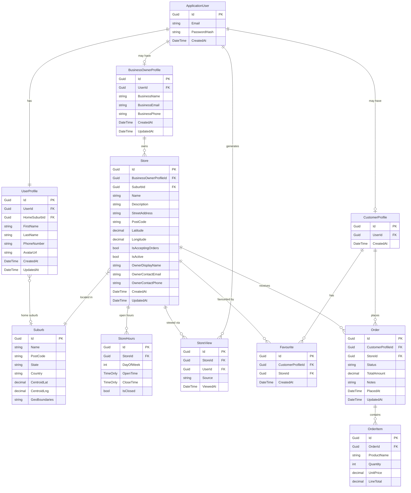

# Central Park — Entity Relationship Diagram

## Notes

| Entity | Key decisions |
|---|---|
| `UserProfile` | Separates app data from ASP.NET Identity. One per user always. |
| `CustomerProfile` | Created when user adopts the customer persona. Absence = not a customer. |
| `BusinessOwnerProfile` | Created when user adopts the business owner persona. Same user can hold both. |
| `Suburb` | Seed / reference data. `GeoBoundaries` stored as GeoJSON — upgrade to SQL Server `geography` + NetTopologySuite for proximity queries. |
| `StoreHours` | One row per day. Unique on `(StoreId, DayOfWeek)`. |
| `Favourite` | First-class entity (not a pure junction) — room to add metadata. Unique on `(CustomerProfileId, StoreId)`. |
| `OrderItem` | Denormalises `ProductName` and `UnitPrice` at order time to protect history from future product changes. |
| `StoreView` | Append-only analytics table. `UserId` references `ApplicationUser` directly (not `CustomerProfile`) so guest/anonymous views can be added later by making it nullable. `Source` captures entry point — e.g. `"search"`, `"map"`, `"favourites"`. Never updated, only inserted. |

## Reserved for future design
- `GarageSale` — linked to `Store` or `BusinessOwnerProfile`
- `Activity` — linked to `Suburb` or `Store`
- `Product` — when store inventory becomes first-class
- `Review` — Customer reviews a Store, scoped to a completed Order
